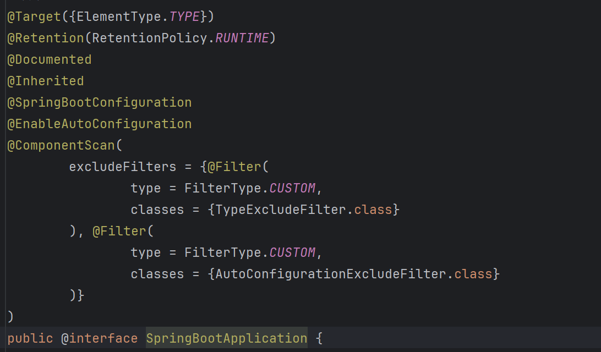
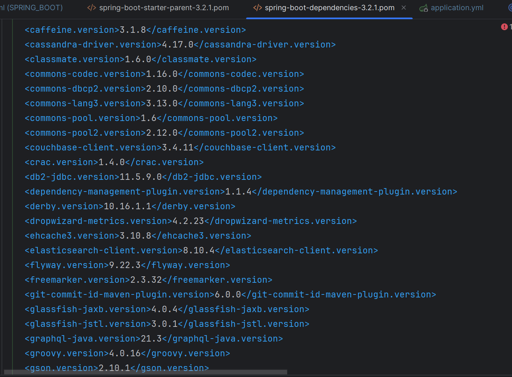
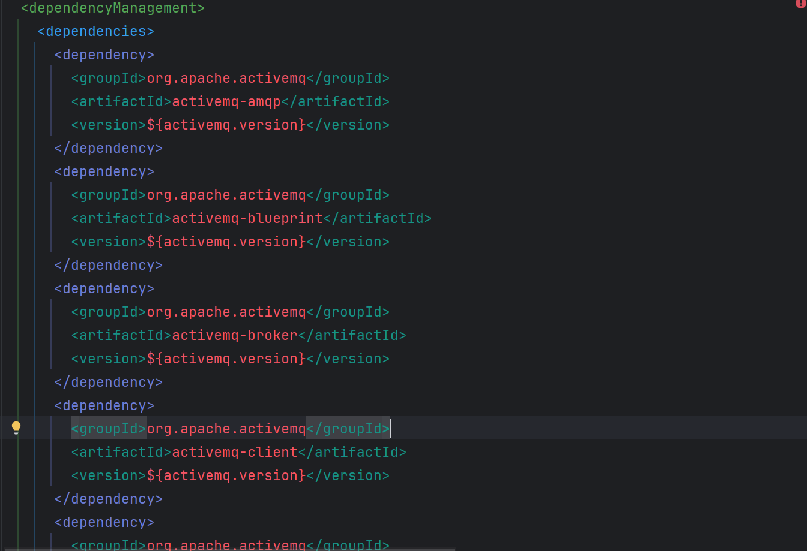

# SpringBoot3

## 1.Spring Boot简述

Spring Boot 是一个用于创建基于 Spring 框架的应用程序的开发工具。它简化了基于 Spring 的应用程序的配置和部署过程，底层实际上仍然是spring。Spring Boot 提供了一组开箱即用的功能，包括自动配置、起步依赖、嵌入式 Web 服务器等，使开发人员==可以更快地构建== Spring 应用程序。

spring boot的主要特点：

1. ***开箱即用***：springboot已经为项目配置提供了合理的默认值，可以直接拿来使用
2. ***嵌入式 Web 服务器（Embedded Web Server）***：Spring Boot 支持嵌入式的 Tomcat、Jetty 或 Undertow 等 Web 服务器，开发人员可以将应用程序打包成一个可执行的 JAR 文件，并直接运行，无需打成war包。
3. ***Actuator***：Spring Boot Actuator 提供了监控和管理 Spring Boot 应用程序的端点（endpoints），包括应用程序的健康状况、信息、指标等。
4. ***简化的配置***：Spring Boot 通过约定大于配置的理念，尽可能减少了配置文件的编写量，提供了默认的配置。
5. ***灵活性***：尽管 Spring Boot 提供了很多默认配置，但开发人员仍然可以根据需要自定义配置，并且可以轻松地覆盖默认配置。并且能够轻松整合别的框架，例如mybatis等。

==简而言之：Spring Boot的出现就是为了简化spring的开发==

## 二、Spring Boot中的几个概念

### 2.1 启动器（starter）

在先前我们开发的时候，在某个场景一般会导入一些固定的依赖。例如我们在进行web开发的时候一般会引入spring MVC、jackson、servlet等依赖。而启动器相当于是把这些依赖打了个包，引入这一个依赖就会连带着把上述的依赖全部引入

如图所示，我们引入了spring-boot-stater-web这一个依赖那么基本上web开发所需要的依赖都给导好了。

并且能够保证这些依赖之间不会发生冲突，自动进行==相关的一些配置==，减轻开发者的心智压力，专注于业务逻辑的实现。那么显而易见的是，这么做还可以快速启动和开发应用程序，并且很好的实现了模块化。使得应用程序的不同模块可以进行分离和解耦，提高了程序的可扩展性。

spring官方提供了很多预定义的启动器，例如spring-boot-starter-web，spring-boot-starter-security等等，一般命名为spring-boot-starter-xxx。

当然有官方提供的启动器也会有第三方提供的启动器，例如MybatisPlus提供的，mybatis-plus-spring-boot3-starter。

### 2.2 @SpringBootApplication注解

我们可以看到SpringBootApplication这个注解主要实现了以下三个功能：

* 自动配置：@EnableAutoConfiguration注解用于其中SpringBoot的自动配置机制。SpringBoot项目能够自动根据引入的启动器中的相关配置文件等来自动配置各种常见的配置和功能，让开发者省去大量手动配置的时间。
* 声明配置类：`@SpringBootConfiguration` 注解实际上是 Spring Boot 中的一个元注解，它本质上是 `@Configuration` 注解的派生。前面学习spring的时候我们都知道@Configuration注解，会把标注的类声明为配置类，进行相关的配置。
* 组件扫描：@SpringBootApplication中包含了@CoponentScan注解，它能够自动扫描程序中的组件，比如Controllers，Service，Repositories等，然后将其纳入Spring Boot应用程序的上下文。使用了@SpringBootApplication这个注解后被标注的类所在的包及其子包中的组件都会被纳入spring程序上下文中。

### 2.3 springboot项目的依赖管理

我们注意到在一个Spring Boot项目中，很多依赖是不需要我们书写版本号的。这是因为每一个Spring Boot项目都有一个父项目spring-boot-starter-parent

spring-boot-starter-parent的父项目又是spring-boot-dependencies

spring-boot-dependencies声明了所有常见的依赖的版本

### 2.4 配置文件

> 前面我们已经提到了，Spring Boot项目会自动为我们进行开发所需的配置，但是默认的配置有时候可能不满足我们的需要，需要修改这些配置。例如Spring Boot项目启动后一般都是通过8080端口访问，但不巧的是你的电脑的8080已经被占用且不能关闭，那就需要修改我们项目所需要的端口。

Spring Boot项目都会有一个默认配置文件application.properties在src/main/resource目录下。我们能够在这个文件中对项目进行统一的配置管理。

值得一提的是

* 配置文件必须命名为application
* 文件格式可以为.yml，.properties，.yaml。
* 并且可以同时存在多个配置文件，但如果同时存在多个配置文件，.properties文件的优先级是最高的，剩下两种优先级相同。