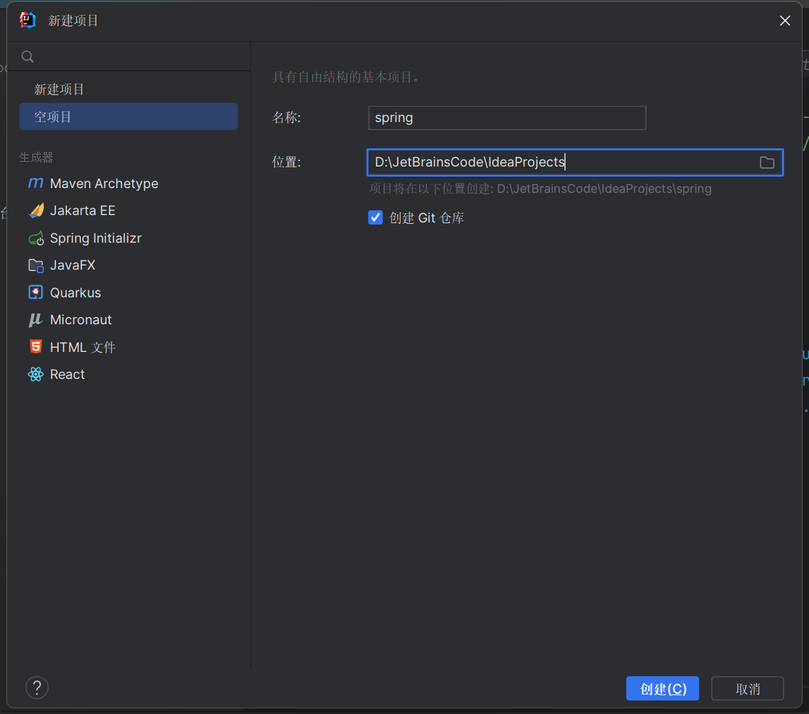
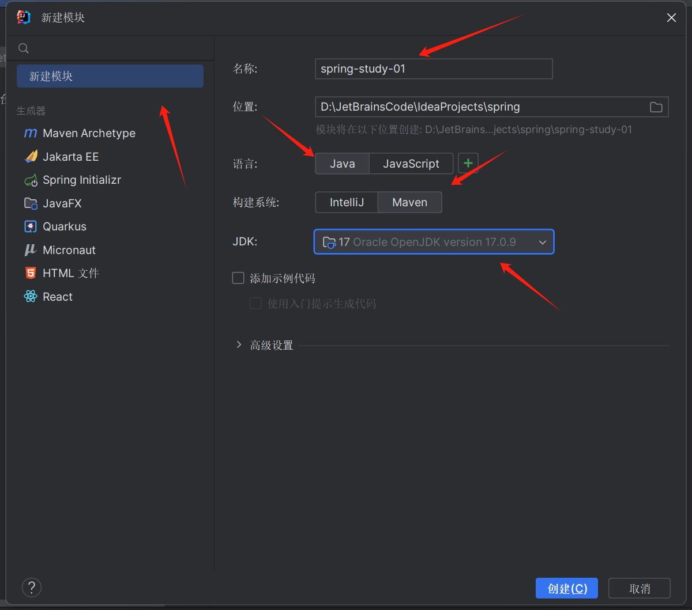
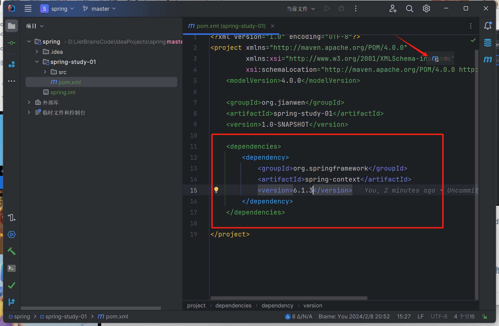
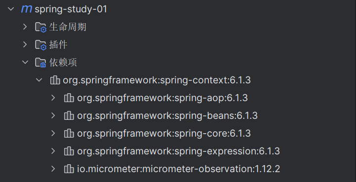
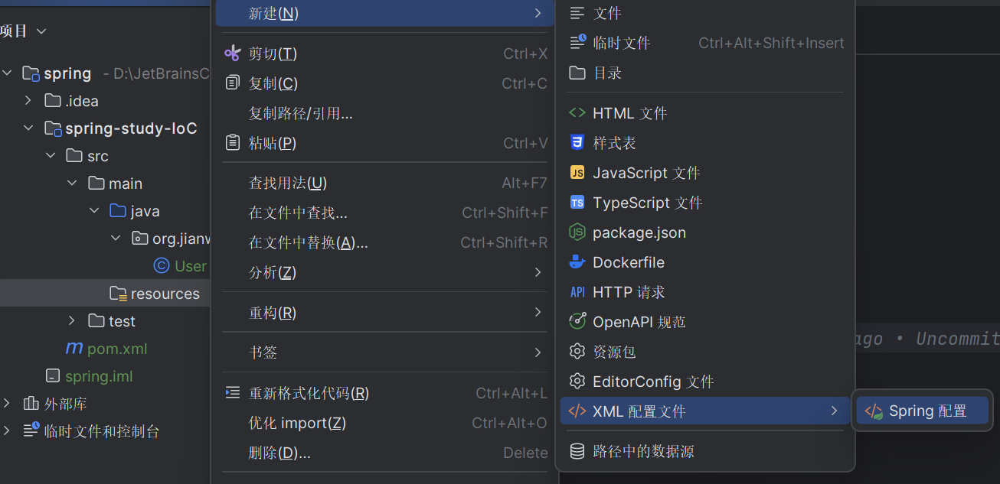
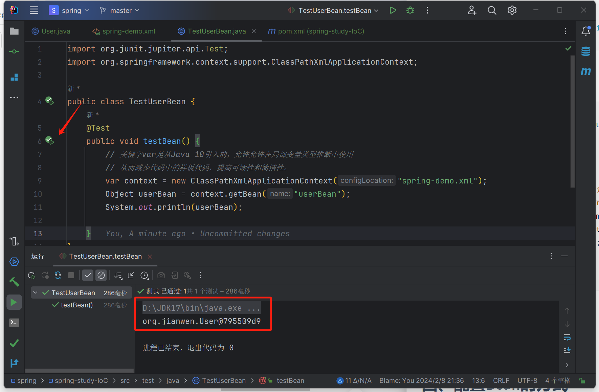
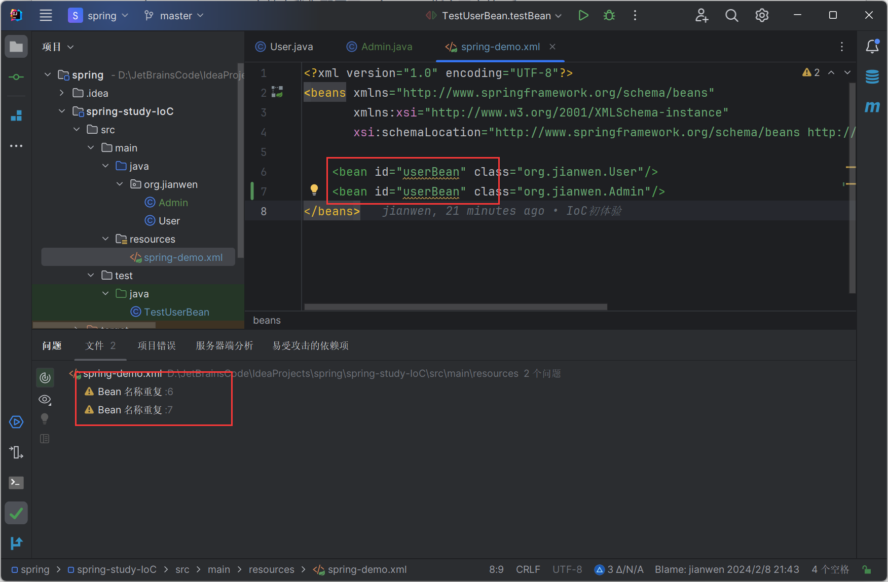
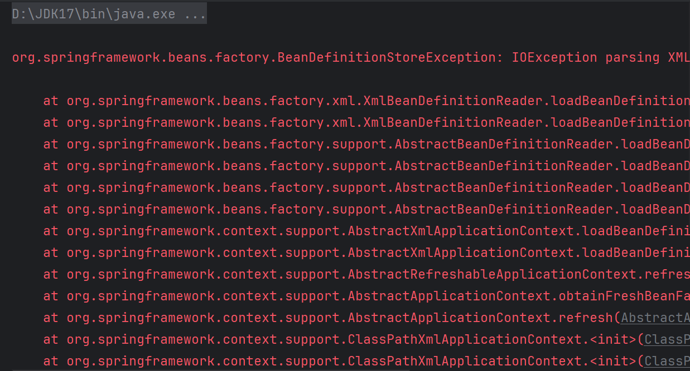
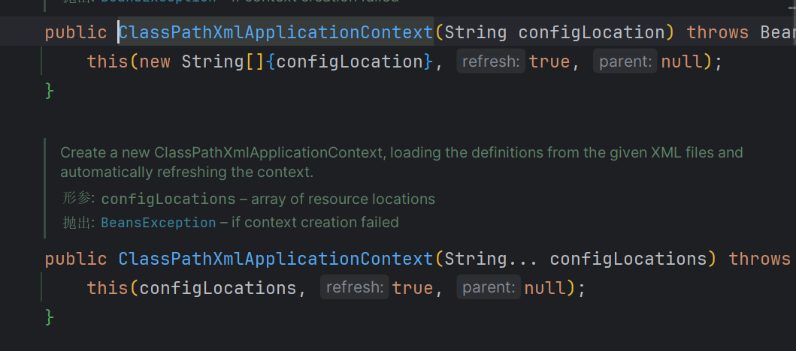

# Spring6

* JDK : 17
* Spring：6.1.3
* IDEA : 2023.2.2
* MAVEN ：3.8.8

[Spring Framework官方文档](https://docs.spring.io/spring-framework/reference/index.html)

## 一、Spring简述

事实上Spring这个词在不同的上下文中有着不同的含义，它可以用来指Spring Framework项目本身，它是一切的开始。

但随着时间的推移，Spring不断发展，其他Spring项目也建立在Spring框架之上，例如Spring MVC、Spring Boot、Spring Security等等。大多数情况下，当人们提及Spring的时候，往往指代的是整个项目系列。但在本文中我们重点关注Spring Framework本身，正如前面所说，Spring Framework是其他Spring项目的基石！

### 1.1 Spring Framework简介

Why Spring？

* Spring 是一个开源免费的框架，轻量，且是非侵入式的。

* IoC（控制反转）容器

  Spring 使用了 IoC 容器，它负责对象的创建、组装和管理对象之间的依赖关系，这样可以降低组件之间的耦合度，并且使得应用程序更容易进行测试和维护。当程序使用了IoC容器，一个对象依赖的其它对象就会通过被动的方式传递进来，而不是让这个对象自己在内部创建所依赖的对象。

*  AOP（面向切面编程）支持

   Spring 提供了强大的 AOP 支持，使得开发者可以将横切关注点（例如日志、事务管理等）从核心业务逻辑中分离出来，这样可以提高代码的模块化和可维护性。

* 声明式事务管理

  Spring 提供了声明式的事务管理，使得开发者可以通过简单的配置来管理事务，而不需要在代码中硬编码事务逻辑。

* 模块化

  Spring 被模块化地设计，开发者可以根据自己的需求选择需要的模块，例如 Spring Core、Spring MVC、Spring Data 等。

### 1.2 创建第一个Spring程序

* 首先用IDEA创建一个空项目

* 接着在这个空项目中新建一个模块spring-study-01

* 然后添加spring-context依赖，找到spring-study-001模块，然后打开该模块下的pom.xml文件夹，增添矩形区域内代码，然后点击箭头指向的图标，==重新加载Maven项目==引入依赖（jar包）

当加入spring context的依赖之后，会关联引入其他依赖：

* ***spring-aop*** ： 提供了对面向切面编程（AOP）的支持。这个模块包含了用于实现面向切面编程的相关功能和类。
* ***spring-beans*** ：提供了对 Bean 的管理和操作的支持。在 Spring 应用程序中，Bean 是被 Spring 容器管理的对象，它们通过依赖注入的方式来实现解耦和组件化。是IoC容器的核心
* ***spring-core*** ： Spring Framework 中最基础、最核心的模块之一，它提供了整个 Spring 框架的基础设施支持。spring-core包含了许多核心的类和接口，用于实现依赖注入、资源管理、类型转换等基本功能。
* ***spring-expression*** ： 用于支持 SpEL（Spring Expression Language）——Spring 表达式语言。SpEL 提供了在运行时对对象进行查询和操作的强大语言，通常用于配置文件、注解、XML 配置等地方。
* ***micrometer-observation*** ： 为spring应用程序提供可观察性支持

第一个spring程序搭建完毕。

------

## 二、IoC（控制反转）

### 2.1 IoC本质

***IoC***（即Inversion of Control，简写为IoC），是一种设计思想，用来降低代码之间的耦合度。在过去我们编写程序的过程中，对象的创建和对象之间的依赖都由程序员决定，硬编码在程序中。==而控制反转则是将对象的创建权和对象之间关系（依赖）的维护的权利都交出去，由IoC容器来负责。==

### 2.2 IoC初体验

首先我们引入JUnit依赖，方便进行测试，修改pom文件，再点击重新加载Maven项目，引入依赖。

~~~xml
    <dependencies>
        <dependency>
            <groupId>org.springframework</groupId>
            <artifactId>spring-context</artifactId>
            <version>6.1.3</version>
        </dependency>

        <dependency>
            <groupId>org.junit.jupiter</groupId>
            <artifactId>junit-jupiter-api</artifactId>
            <version>5.9.2</version>
            <scope>test</scope>
        </dependency>

    </dependencies>
~~~

* 首先我们需要定义一个Bean，或者说一个类（但是，必须注意这个类要有`无参构造函数`，这一点后面会细说）

~~~java
package org.jianwen;

public class User {
    String name;

    public User() {
        this.name = null;
    }

    public User(String name) {
        this.name = name;
    }
}
~~~

* 新建配置文件，并命名为`spring-demo`

* 在spring-demo.xml中配置Bean

~~~xml
<?xml version="1.0" encoding="UTF-8"?>
<beans xmlns="http://www.springframework.org/schema/beans"
       xmlns:xsi="http://www.w3.org/2001/XMLSchema-instance"
       xsi:schemaLocation="http://www.springframework.org/schema/beans http://www.springframework.org/schema/beans/spring-beans.xsd">

    
    <bean id="userBean" class="org.jianwen.User"/>
</beans>
~~~

* 测试

在test目录下新建一个测试类TestUserBean

~~~java
import org.junit.jupiter.api.Test;
import org.springframework.context.support.ClassPathXmlApplicationContext;

public class TestUserBean {
    @Test
    public void testBean() {
        // 关键字var是从Java 10引入的，允许允许在局部变量类型推断中使用
        // 从而减少代码中的样板代码，提高可读性和简洁性。
        var context = new ClassPathXmlApplicationContext("spring-demo.xml");
        Object userBean = context.getBean("userBean");
        System.out.println(userBean);

    }
}
~~~

点击方法左侧的启动三角形，得到如下结果

事实证明，确实有一个User类的实例被创建出来了，而且不是我们程序员自己手动new出来的。下面我们来详细分析其背后的原理。

### 2.3 程序分析

在之前我们启动，并且成功运行了我们的程序。对比之前的开发，我们多做的事情无非就是

* 引入了spring-context依赖，JUnit依赖（JUnit依赖是为了方便我们测试用的，可有可无！）
* 在resources目录下新建了一个spring-demo.xml的配置文件，并在配置文件中对Bean进行了配置。
* 书写了两行莫名其妙的代码

~~~java
var context = new ClassPathXmlApplicationContext("spring-demo.xml");
Object userBean = context.getBean("userBean");
~~~

#### 2.3.1 spring-demo.xml配置文件

在spring-demo.xml文件中我们配置了一个bean，指定了它的id和class。

~~~xml
<bean id="userBean" class="org.jianwen.User"/>
~~~

* id属性可以理解为每一个Bean的`身份证`，能够`唯一标识`一个Bean。IoC容器可以根据id精确的找到相应的Bean，先前我们在测试类中书写的代码就是通过id寻找到对应的bean
  * 显然id是不能重复的，我们新建一个Admin类，然后再xml文件进行相应的配置

~~~java
package org.jianwen;

public class Admin {
}

~~~

~~~xml
<?xml version="1.0" encoding="UTF-8"?>
<beans xmlns="http://www.springframework.org/schema/beans"
       xmlns:xsi="http://www.w3.org/2001/XMLSchema-instance"
       xsi:schemaLocation="http://www.springframework.org/schema/beans http://www.springframework.org/schema/beans/spring-beans.xsd">

    <bean id="userBean" class="org.jianwen.User"/>
    <bean id="userBean" class="org.jianwen.Admin"/>
</beans>
~~~

其实我们发现IDEA已经给了我们警告

启动程序，得到如下结果：

显然如果我们也不可能通过id获取一个不存在的bean。

==为了方便后续测试的正常运行我们先把第二个bean配置给删掉==

~~~xml
<?xml version="1.0" encoding="UTF-8"?>
<beans xmlns="http://www.springframework.org/schema/beans"
       xmlns:xsi="http://www.w3.org/2001/XMLSchema-instance"
       xsi:schemaLocation="http://www.springframework.org/schema/beans http://www.springframework.org/schema/beans/spring-beans.xsd">

    <bean id="userBean" class="org.jianwen.User"/>
</beans>
~~~

* class属性则指明了这个Bean的类型（注意：后面必须跟全限定类名，即类所在的包名 + 类名），这样IoC容器才能知道到底要创建哪种类型的Bean

#### 2.3.2 两行代码

在 Spring 框架中，bean 的存储和管理方式是通过 bean 容器来实现的。Spring 提供了多种类型的 bean 容器，其中最常见的是 ApplicationContext 接口的各种实现，如 ClassPathXmlApplicationContext、AnnotationConfigApplicationContext 等。本例即使用ClassPathXmlApplicationContext。

~~~java
var context = new ClassPathXmlApplicationContext("spring-demo.xml");
Object userBean = context.getBean("userBean");
~~~

`ClassPathXmlApplicationContext` 从类路径（classpath）中加载 XML 格式的配置文件，并根据配置文件中定义的内容创建应用程序上下文（即bean容器）。

spring-demo.xml作为参数传递给`ClassPathXmlApplicationContext`构造函数，指定spring应用程序上下文需要加载的XML配置文件的名称。其中值得一提的是spring配置文件的命名是可以自由发挥的，可以是spring-demo.xml也可以是spring.xml还可以是hahh.xml等等，取决于自己。并且通过观察源码我们可以看到实际上`ClassPathXmlApplicationContext`有一个构造函数是能够接收多个参数的，我们完全可以传多个xml文件，也就是说把多个配置文件中的bean加载到一个容器当中。

spring通过解析spring-demo.xml文件，获得配置文件中配置的所有bean的全限定类名。然后spring底层通过反射，==调用无参构造函数==来创建对象（这就是前面提到的为什么必须要有无参构造函数！），最后存放在相应的spring容器中。第二行代码就是，在容器中通过id去获取一个bean。
