# SpringSecurity

[[toc]]

版本配置：

> * SpringBoot : 3.2.2
> * SpringSecurity : 6.2.0
> * JDK : 17
> * MySQL : 8.0.35

SpringSecurity官方文档

https://docs.spring.io/spring-security/reference/index.html

SpringSecurity官方示例

https://github.com/spring-projects/spring-sec

## 一. SpringSecurity简述

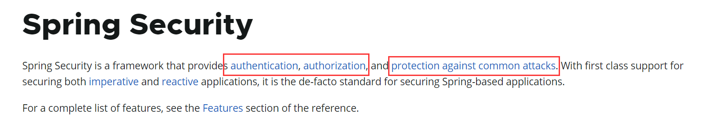

Spring Security 是一个提供`身份验证`、`授权`和`针对常见攻击的保护`的框架。 凭借对保护命令式和反应式应用程序的一流支持，它成为保护基于 Spring 的应用程序的事实上的标准。 

* 身份认证：是指确认用户身份是否有效的过程，确保用户是其声称的那个人，并且具有访问系统资源的权限。

  Spring Security 提供了各种身份认证的方式和机制，包括但不限于：

  1. **基于表单的认证：** 用户通过输入用户名和密码来进行身份验证，通常在 Web 应用程序中使用。
  2. **HTTP 基本认证和摘要认证：** 基于 HTTP 协议的基本身份认证和摘要身份认证。
  3. **OAuth 认证：** 支持 OAuth 协议，允许用户通过第三方身份提供者进行身份验证。
  4. **JWT 认证：** 使用 JSON Web Token（JWT）进行身份验证和授权。
  5. **LDAP 认证：** 通过 Lightweight Directory Access Protocol（LDAP）进行身份验证，常用于企业环境中集中管理用户身份。
  6. **CAS 认证：** 使用 Central Authentication Service（CAS）进行单点登录和身份验证。

* 授权：用户身份认证完成后，SpringSecurity能够控制用户所能够访问的资源

* 防御常见攻击：

  * CSRF

## 二、第一个SpringSecurity程序

项目结构：

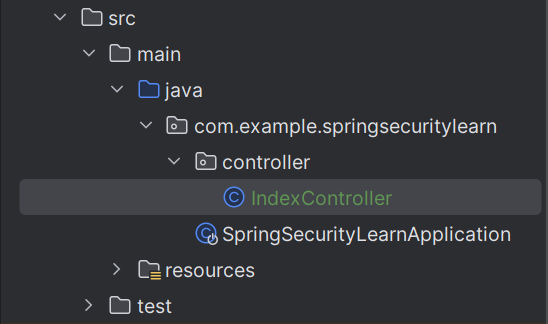

pom.xml

~~~xml
<?xml version="1.0" encoding="UTF-8"?>
<project xmlns="http://maven.apache.org/POM/4.0.0" xmlns:xsi="http://www.w3.org/2001/XMLSchema-instance"
         xsi:schemaLocation="http://maven.apache.org/POM/4.0.0 https://maven.apache.org/xsd/maven-4.0.0.xsd">
    <modelVersion>4.0.0</modelVersion>
    <parent>
        <groupId>org.springframework.boot</groupId>
        <artifactId>spring-boot-starter-parent</artifactId>
        <version>3.2.2</version>
        <relativePath/> <!-- lookup parent from repository -->
    </parent>
    <groupId>com.example</groupId>
    <artifactId>SpringSecurityLearn</artifactId>
    <version>0.0.1-SNAPSHOT</version>
    <name>SpringSecurityLearn</name>
    <description>SpringSecurityLearn</description>
    <properties>
        <java.version>17</java.version>
    </properties>
    <dependencies>
        <dependency>
            <groupId>org.springframework.boot</groupId>
            <artifactId>spring-boot-starter-security</artifactId>
        </dependency>
        <dependency>
            <groupId>org.springframework.boot</groupId>
            <artifactId>spring-boot-starter-web</artifactId>
        </dependency>

        <dependency>
            <groupId>org.springframework.boot</groupId>
            <artifactId>spring-boot-devtools</artifactId>
            <scope>runtime</scope>
            <optional>true</optional>
        </dependency>
        <dependency>
            <groupId>org.springframework.boot</groupId>
            <artifactId>spring-boot-starter-test</artifactId>
            <scope>test</scope>
        </dependency>
        <dependency>
            <groupId>org.springframework.security</groupId>
            <artifactId>spring-security-test</artifactId>
            <scope>test</scope>
        </dependency>
    </dependencies>

    <build>
        <plugins>
            <plugin>
                <groupId>org.springframework.boot</groupId>
                <artifactId>spring-boot-maven-plugin</artifactId>
            </plugin>
        </plugins>
    </build>

</project>
~~~


IndexController

~~~java
package com.example.springsecuritylearn.controller;

import org.springframework.web.bind.annotation.GetMapping;
import org.springframework.web.bind.annotation.RestController;

@RestController
public class IndexController {
    @GetMapping("/")
    public String index() {
        return "index.html";
    }
}
~~~

启动项目后会跳转到如下页面：


* Username：user

* Password：在控制台自动生成(很明显这是一个UUID格式)

  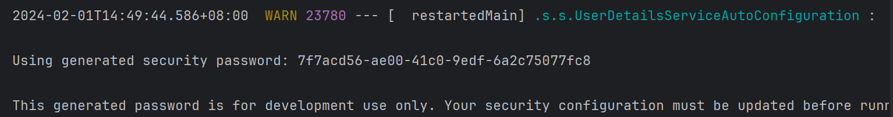

正确输入两项之后便能够得到如下结果：


登录页面渲染异常或者无法页面卡死无法进入等页面，则是由于SpringSecurity自动为我们生成的登陆页面中的bootstra.min.css资源无法加载导致的，需要科学。

## 三、SpringSecurity底层原理

### 3.1 Filter复习

Spring Security 的 Servlet 支持是基于 Servlet Filter 的。下图显示了单个 HTTP 请求的处理程序的典型分层。


客户端向应用程序发送一个请求，容器创建一个 `FilterChain`，其中包含 `Filter` 实例和 `Servlet`，应该根据请求URI的路径来处理 `HttpServletRequest`。在Spring MVC应用程序中，Servlet是 [`DispatcherServlet`](https://docs.spring.io/spring-framework/docs/6.1.0-M2/reference/html/web.html#mvc-servlet) 的一个实例。一个 `Servlet` 最多可以处理一个 `HttpServletRequest` 和 `HttpServletResponse`。然而，可以使用多个 `Filter` 来完成如下工作。

- 防止下游的 `Filter` 实例或 `Servlet` 被调用。在这种情况下，`Filter` 通常会使用 `HttpServletResponse` 对客户端写入响应。
- 修改下游的 `Filter` 实例和 `Servlet` 所使用的 `HttpServletRequest` 或 `HttpServletResponse`。

> 前面的IndexController底层实际上正是Servlet

一般情况下都是采用SpringBoot来集成SpringSecurity，而SpringBoot底层还是Spring那一套，因此我们很自然的想到可以将过滤器实例作为Bean交给Spring上下文管理。那么在对Filter的使用上就会更加灵活。

### 3.2 DelegatingFilterProxy

Spring 提供了一个名为 [`DelegatingFilterProxy`](https://docs.spring.io/spring-framework/docs/6.1.0-M2/javadoc-api/org/springframework/web/filter/DelegatingFilterProxy.html) 的 `Filter` 实现，允许在 Servlet 容器的生命周期和 Spring 的 `ApplicationContext` 之间建立桥梁。Servlet容器允许通过使用自己的标准来注册 `Filter` 实例，但它不知道 Spring 定义的 Bean。你可以通过标准的Servlet容器机制来注册 `DelegatingFilterProxy`，但将所有工作委托给实现 `Filter` 的Spring Bean。

下面是 `DelegatingFilterProxy` 如何融入 Filter实例和FilterChain


例如上图，DelegatingFilterProxy从ApplicationContext中查找到Bean Filter~0~，然后待用Bean Filter~0~。

也就是说，它允许延迟查找Filter Bean实例。在容器启动之前，容器需要注册Filter实例。然而，Spring通常使用ContextLoaderListener来加载Spring Bean，这在需要注册Filter实例之后才会完成。

DelegatingFilterProxy的伪码

~~~java
public void doFilter(ServletRequest request,ServletResponse response,FilterChain chain){
    Filter delegate = getFilterBean(someBeanName);
    delegate.doFilter(request,response);
}
~~~

> DelegatingFilterProxy就是一个Filter可以被注册在Servlet的过滤器链中，然后注册在Spring容器中的Bean Filter就可以被DelegatinFilterProxy调用，从而工作在整个Servlet生命周期中。

这么做，对于Filter的启用等操作就会方便灵活很多。

### 3.3 FilterChainProxy

Spring Security 的 Servlet 支持包含在 `FilterChainProxy` 中。`FilterChainProxy` 是 Spring Security 提供的一个特殊的 `Filter`，允许通过 `SecurityFilterChain`委托给许多 `Filter` 实例。由于 FilterChainProxy是一个Bean，它通常被包裹在 DelegatingFilterProxy中。


### 3.4  SecurityFilterChain

> 实际应用情况

)

SecurityFilterChain被FilterChainProxy用来确定当前请求应该调用哪些Spring Security Filter实例

`SecurityFilterChain` 中的 `Security Filter` 通常是`Bean`，但它们是用 `FilterChainProxy` 而不是 `DelegatingFilterProxy `注册的。与直接向Servlet容器或 `DelegatingFilterProxy `注册相比，`FilterChainProxy` 有很多优势。首先，它为 Spring Security 的所有 Servlet 支持提供了一个起点。由于这个原因，如果你试图对 Spring Security 的 Servlet 支持进行故障诊断，在 `FilterChainProxy` 中添加一个调试点是一个很好的开始。

其次，由于 `FilterChainProxy` 是 Spring Security 使用的核心，它可以执行一些不被视为可有可无的任务。 例如，它清除了 `SecurityContext` 以避免内存泄漏。它还应用Spring Security的 [`HttpFirewall`](https://springdoc.cn/spring-security/servlet/exploits/firewall.html#servlet-httpfirewall) 来保护应用程序免受某些类型的攻击。

此外，它在确定何时应该调用 `SecurityFilterChain` 方面提供了更大的灵活性。在Servlet容器中，`Filter` 实例仅基于URL被调用。 然而，`FilterChainProxy` 可以通过使用 `RequestMatcher` 接口，根据 `HttpServletRequest` 中的任何内容确定调用。

下图为多SecurityFilterChain实例。


FilterChainProxy会根据请求决定使用哪个SecurityFilterChain，而且最多调用一个。如果请求的URL是/api/message/，那么==按顺序来==它首先与SpringSecurity~n0~相匹配，尽管他还和最后一个SecurityFilterChain匹配，但是FilterChainProxy仍然只调用==第一次模式匹配的SecurityFilterChain==即n0。

## 四、DefaultSecurityFilterChain

### 4.1 简要分析

首先在IDEA中搜索DefaultSecurityFilterChain

~~~java
/*
 * Copyright 2002-2021 the original author or authors.
 *
 * Licensed under the Apache License, Version 2.0 (the "License");
 * you may not use this file except in compliance with the License.
 * You may obtain a copy of the License at
 *
 *      https://www.apache.org/licenses/LICENSE-2.0
 *
 * Unless required by applicable law or agreed to in writing, software
 * distributed under the License is distributed on an "AS IS" BASIS,
 * WITHOUT WARRANTIES OR CONDITIONS OF ANY KIND, either express or implied.
 * See the License for the specific language governing permissions and
 * limitations under the License.
 */

package org.springframework.security.web;

import java.util.ArrayList;
import java.util.Arrays;
import java.util.List;

import jakarta.servlet.Filter;
import jakarta.servlet.http.HttpServletRequest;
import org.apache.commons.logging.Log;
import org.apache.commons.logging.LogFactory;

import org.springframework.core.log.LogMessage;
import org.springframework.security.web.util.matcher.RequestMatcher;

/**
 * Standard implementation of {@code SecurityFilterChain}.
 *
 * @author Luke Taylor
 * @since 3.1
 */
public final class DefaultSecurityFilterChain implements SecurityFilterChain {

	private static final Log logger = LogFactory.getLog(DefaultSecurityFilterChain.class);

	private final RequestMatcher requestMatcher;

	private final List<Filter> filters;

	public DefaultSecurityFilterChain(RequestMatcher requestMatcher, Filter... filters) {
		this(requestMatcher, Arrays.asList(filters));
	}

	public DefaultSecurityFilterChain(RequestMatcher requestMatcher, List<Filter> filters) {
		if (filters.isEmpty()) {
			logger.info(LogMessage.format("Will not secure %s", requestMatcher));
		}
		else {
			logger.info(LogMessage.format("Will secure %s with %s", requestMatcher, filters));
		}
		this.requestMatcher = requestMatcher;
		this.filters = new ArrayList<>(filters);
	}

	public RequestMatcher getRequestMatcher() {
		return this.requestMatcher;
	}

	@Override
	public List<Filter> getFilters() {
		return this.filters;
	}

	@Override
	public boolean matches(HttpServletRequest request) {
		return this.requestMatcher.matches(request);
	}

	@Override
	public String toString() {
		return this.getClass().getSimpleName() + " [RequestMatcher=" + this.requestMatcher + ", Filters=" + this.filters
				+ "]";
	}
}
~~~

启动SpringBoot项目，发现在控制台打印了这样一条语句

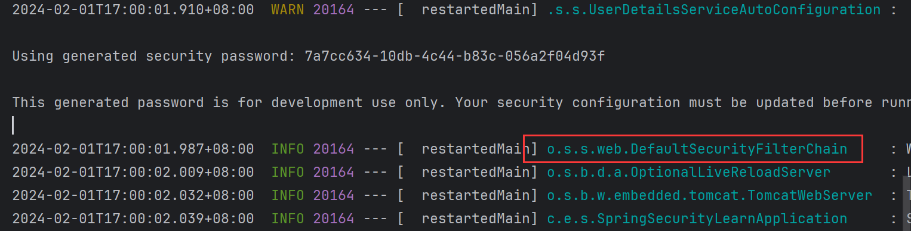

后面的具体内容为：

Will secure any request with [org.springframework.security.web.session.DisableEncodeUrlFilter@409a76d4, org.springframework.security.web.context.request.async.WebAsyncManagerIntegrationFilter@3e768587, org.springframework.security.web.context.SecurityContextHolderFilter@5c0bb8a, org.springframework.security.web.header.HeaderWriterFilter@82d2d7c, org.springframework.web.filter.CorsFilter@244d6082, org.springframework.security.web.csrf.CsrfFilter@7a39e757, org.springframework.security.web.authentication.logout.LogoutFilter@11a10c17, org.springframework.security.web.authentication.UsernamePasswordAuthenticationFilter@494c89b2, org.springframework.security.web.authentication.ui.DefaultLoginPageGeneratingFilter@5c9f48fa, org.springframework.security.web.authentication.ui.DefaultLogoutPageGeneratingFilter@fae6ead, org.springframework.security.web.authentication.www.BasicAuthenticationFilter@231bb139, org.springframework.security.web.savedrequest.RequestCacheAwareFilter@9d27d01, org.springframework.security.web.servletapi.SecurityContextHolderAwareRequestFilter@7c212ae2, org.springframework.security.web.authentication.AnonymousAuthenticationFilter@1c91955a, org.springframework.security.web.access.ExceptionTranslationFilter@1b82d3af, org.springframework.security.web.access.intercept.AuthorizationFilter@5b7bcedf]

这些内容的格式似乎有点眼熟？

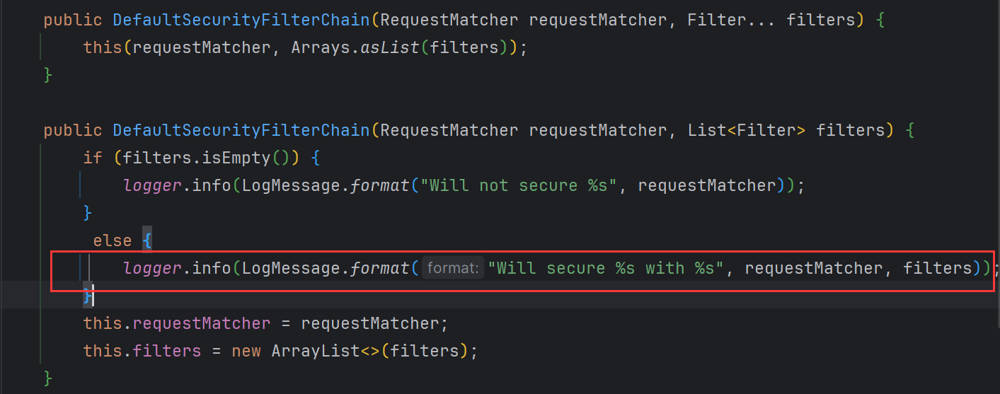

构造方法的调用顺序是显而易见的，默认过滤器链中也能清楚的看到16个Filter。

### 4.2 修改默认配置

> 默认过滤器链当然不可能完全符合使用需求，因此有必要对其进行一定的修改。

首先，在之前访问项目资源的时候，必须先登录。登录的默认账号是user，密码是控制台输出的一个字符串。关于默认用户的用户名和密码实际上是在一个类`SecurityProperties`中定义的。

这个类的主要作用是为Spring Security提供默认的配置属性，并且允许开发者在应用程序中进行自定义配置。

~~~java
/*
 * Copyright 2012-2023 the original author or authors.
 *
 * Licensed under the Apache License, Version 2.0 (the "License");
 * you may not use this file except in compliance with the License.
 * You may obtain a copy of the License at
 *
 *      https://www.apache.org/licenses/LICENSE-2.0
 *
 * Unless required by applicable law or agreed to in writing, software
 * distributed under the License is distributed on an "AS IS" BASIS,
 * WITHOUT WARRANTIES OR CONDITIONS OF ANY KIND, either express or implied.
 * See the License for the specific language governing permissions and
 * limitations under the License.
 */

package org.springframework.boot.autoconfigure.security;

import java.util.ArrayList;
import java.util.EnumSet;
import java.util.List;
import java.util.Set;
import java.util.UUID;

import org.springframework.boot.context.properties.ConfigurationProperties;
import org.springframework.boot.web.servlet.DispatcherType;
import org.springframework.boot.web.servlet.filter.OrderedFilter;
import org.springframework.core.Ordered;
import org.springframework.util.StringUtils;

/**
 * Configuration properties for Spring Security.
 *
 * @author Dave Syer
 * @author Andy Wilkinson
 * @author Madhura Bhave
 * @since 1.0.0
 */
@ConfigurationProperties(prefix = "spring.security")
public class SecurityProperties {

	/**
	 * Order applied to the {@code SecurityFilterChain} that is used to configure basic
	 * authentication for application endpoints. Create your own
	 * {@code SecurityFilterChain} if you want to add your own authentication for all or
	 * some of those endpoints.
	 */
	public static final int BASIC_AUTH_ORDER = Ordered.LOWEST_PRECEDENCE - 5;

	/**
	 * Order applied to the {@code WebSecurityCustomizer} that ignores standard static
	 * resource paths.
	 */
	public static final int IGNORED_ORDER = Ordered.HIGHEST_PRECEDENCE;

	/**
	 * Default order of Spring Security's Filter in the servlet container (i.e. amongst
	 * other filters registered with the container). There is no connection between this
	 * and the {@code @Order} on a {@code SecurityFilterChain}.
	 */
	public static final int DEFAULT_FILTER_ORDER = OrderedFilter.REQUEST_WRAPPER_FILTER_MAX_ORDER - 100;

	private final Filter filter = new Filter();

	private final User user = new User();

	public User getUser() {
		return this.user;
	}

	public Filter getFilter() {
		return this.filter;
	}

	public static class Filter {

		/**
		 * Security filter chain order for Servlet-based web applications.
		 */
		private int order = DEFAULT_FILTER_ORDER;

		/**
		 * Security filter chain dispatcher types for Servlet-based web applications.
		 */
		private Set<DispatcherType> dispatcherTypes = EnumSet.allOf(DispatcherType.class);

		public int getOrder() {
			return this.order;
		}

		public void setOrder(int order) {
			this.order = order;
		}

		public Set<DispatcherType> getDispatcherTypes() {
			return this.dispatcherTypes;
		}

		public void setDispatcherTypes(Set<DispatcherType> dispatcherTypes) {
			this.dispatcherTypes = dispatcherTypes;
		}

	}

	public static class User {

		/**
		 * Default user name.
		 */
		private String name = "user";

		/**
		 * Password for the default user name.
		 */
		private String password = UUID.randomUUID().toString();

		/**
		 * Granted roles for the default user name.
		 */
		private List<String> roles = new ArrayList<>();

		private boolean passwordGenerated = true;

		public String getName() {
			return this.name;
		}

		public void setName(String name) {
			this.name = name;
		}

		public String getPassword() {
			return this.password;
		}

		public void setPassword(String password) {
			if (!StringUtils.hasLength(password)) {
				return;
			}
			this.passwordGenerated = false;
			this.password = password;
		}

		public List<String> getRoles() {
			return this.roles;
		}

		public void setRoles(List<String> roles) {
			this.roles = new ArrayList<>(roles);
		}

		public boolean isPasswordGenerated() {
			return this.passwordGenerated;
		}

	}

}
~~~

可以清楚的看到有一个内部类User，name属性为"user"，password是通过UUID类生成的。

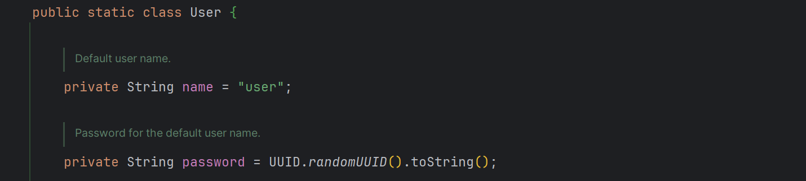

可以在SpringBoot的配置文件中修改

SpringBoot3.2.2的默认的全局配置文件是application.properties，并且其内容为空，这是因为SpringBoot实际上底层已经把相关的配置都配置好了，当我们修改配置文件进行配置时，会修改SpringBoot自动配置的默认值。

项目采用yml格式，即：

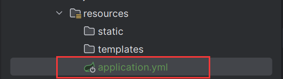

下面配置默认用户名和密码：

~~~yml
Spring:
  security:
    user:
      name: 'jianwen'
      password: '050131'
      
# 等价于在properties中写入
# spring.security.user.name=jianwen
# spring.security.user.password=050131
~~~

启动程序验证即可。

## 五、 Authentication

### 5.1 认证架构

* ***SecurityContextHolder*** - `SecurityContextHolder` 是 `Spring Security` 存储 认证 用户细节的地方。

* ***SecurityContext*** - 是从 `SecurityContextHolder` 获得的，包含了当前认证用户的 Authentication （认证）。

* ***Authentication*** - 可以是 `AuthenticationManager` 的输入，以提供用户提供的认证凭证或来自 SecurityContext 的当前用户。

* ***GrantedAuthority*** - 在` Authentication `（认证）中授予委托人的一种权限（即role、scope等）。

* ***AuthenticationManager*** - 定义 `Spring Security` 的 `Filter` 如何执行 认证 的API。

* ***ProviderManager*** - 最常见的` AuthenticationManager `的实现。

* ***AuthenticationProvider*** - 由 `ProviderManager` 用于执行特定类型的认证。

* 用 ***AuthenticationEntryPoint*** 请求凭证 - 用于从客户端请求凭证（即重定向到登录页面，发送 WWW-Authenticate 响应，等等）。

* ***AbstractAuthenticationProcessingFilter*** - 一个用于认证的基本 `Filter`。这也让我们很好地了解了认证的高层流程以及各部分是如何协作的。


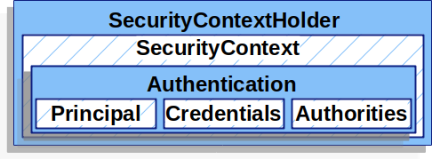

### 5.2 基于用户名/密码的认证

Spring Security为从HttpServletRequest读取用户名和密码提供了以下内置机制

* 表单
* Basic
* Digest

#### 5.2.1 表单登录（Form Login）

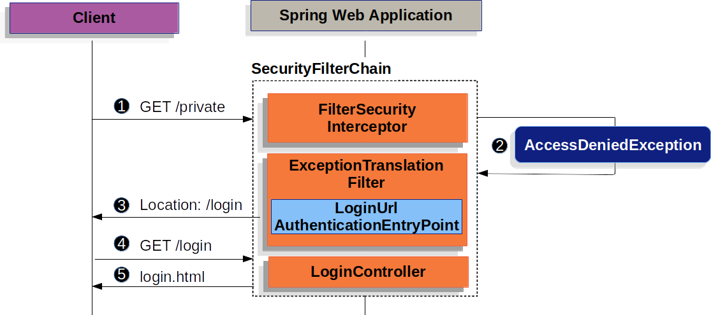

1. 首先，一个用户向并未对其授权的资源发出一个未经认证的请求

2. Spring Security的默认过滤器链中的AuthorizationFilter通过抛出一个AccessDeniedException来表明未经认证的请求被拒绝了。

   AuthorizationFilter类的doFilter方法

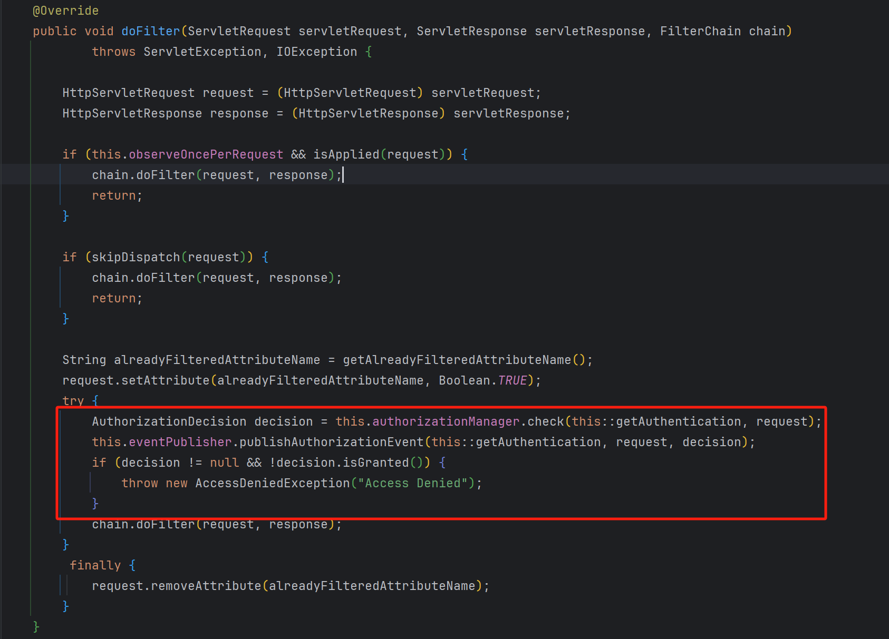

### 5.3 基于数据库的用户认证

* 首先创建数据库

~~~java
-- 创建数据库
CREATE DATABASE `security-demo`;
USE `security-demo`;

-- 创建用户表
CREATE TABLE `user`(
	`id` INT NOT NULL AUTO_INCREMENT PRIMARY KEY,
	`username` VARCHAR(50) DEFAULT NULL ,
	`password` VARCHAR(500) DEFAULT NULL,
	`enabled` BOOLEAN NOT NULL
);
-- 唯一索引
CREATE UNIQUE INDEX `user_username_uindex` ON `user`(`username`); 

-- 插入用户数据(密码是 "abc" )
INSERT INTO `user` (`username`, `password`, `enabled`) VALUES
('admin', '{bcrypt}$2a$10$GRLdNijSQMUvl/au9ofL.eDwmoohzzS7.rmNSJZ.0FxO/BTk76klW', TRUE),
('Helen', '{bcrypt}$2a$10$GRLdNijSQMUvl/au9ofL.eDwmoohzzS7.rmNSJZ.0FxO/BTk76klW', TRUE),
('Tom', '{bcrypt}$2a$10$GRLdNijSQMUvl/au9ofL.eDwmoohzzS7.rmNSJZ.0FxO/BTk76klW', TRUE);
~~~

* 然后引入相关依赖

~~~xml
        <dependency>
            <groupId>com.mysql</groupId>
            <artifactId>mysql-connector-j</artifactId>
        </dependency>
        <dependency>
            <groupId>com.baomidou</groupId>
            <artifactId>mybatis-plus-spring-boot3-starter</artifactId>
            <version>3.5.5</version>
        </dependency>
~~~

* 接着配置数据源，以及在控制台打印mybatis-plus日志

~~~yaml
Spring:
  security:
    user:
      name: 'jianwen'
      password: '050131'
  datasource:
    driver-class-name: com.mysql.cj.jdbc.Driver
    url: jdbc:mysql://localhost:3306/security-demo
    username: root
    password: myyx7731526
mybatis-plus:
  configuration:
    log-impl: org.apache.ibatis.logging.stdout.StdOutImpl
~~~

* 创建entity包，以及User实体类

~~~java
package com.example.springsecuritylearn.entity;

import com.baomidou.mybatisplus.annotation.IdType;
import com.baomidou.mybatisplus.annotation.TableId;
import lombok.Data;

@Data
public class User {
    @TableId(value = "id",type = IdType.AUTO)
    private Integer id;
    // 属性名和表中对应的字段名相同就无需再写注解了
    private String username;
    
    private String password;
    
    private Boolean enabled;
}
~~~

创建mapper和service包，并在service包中创建impl包

~~~java
package com.example.springsecuritylearn.mapper;

import com.baomidou.mybatisplus.core.mapper.BaseMapper;
import com.example.springsecuritylearn.entity.User;

public interface UserMapper extends BaseMapper<User> {
}
~~~

~~~java
package com.example.springsecuritylearn.service;

import com.baomidou.mybatisplus.extension.service.IService;
import com.example.springsecuritylearn.entity.User;

public interface UserService extends IService<User> {
}
~~~

~~~java
package com.example.springsecuritylearn.service.impl;

import com.baomidou.mybatisplus.extension.service.impl.ServiceImpl;
import com.example.springsecuritylearn.entity.User;
import com.example.springsecuritylearn.mapper.UserMapper;
import com.example.springsecuritylearn.service.UserService;
import org.springframework.stereotype.Service;

@Service
public class UserServiceImpl extends ServiceImpl<UserMapper, User> implements UserService {

}
~~~

创建UserMapper.xml

~~~java
<?xml version="1.0" encoding="UTF-8"?>
<!DOCTYPE mapper PUBLIC "-//mybatis.org//DTD Mapper 3.0//EN" "http://mybatis.org/dtd/mybatis-3-mapper.dtd">
<mapper namespace="package com.example.springsecuritylearn.mapper">

</mapper>
~~~

项目结构如下

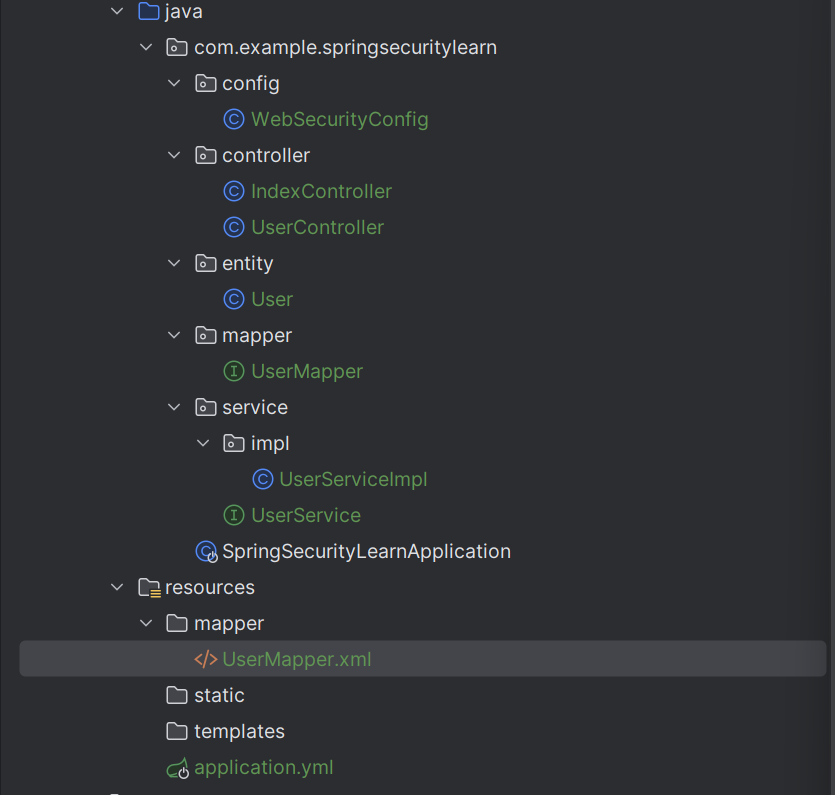

创建UserController

~~~java
package com.example.springsecuritylearn.controller;

import com.example.springsecuritylearn.entity.User;
import com.example.springsecuritylearn.service.UserService;
import jakarta.annotation.Resource;
import org.springframework.web.bind.annotation.RequestMapping;
import org.springframework.web.bind.annotation.RestController;

import java.util.List;

@RestController
@RequestMapping("/")
public class UserController {
    @Resource
    public UserService userService;
    @RequestMapping("/list")
    public List<User> getUserList(){
        return userService.list();
    }
}
~~~

启动项目报错：

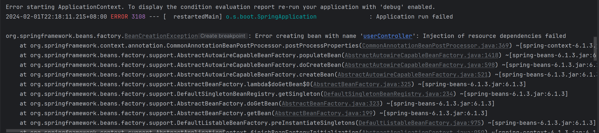

这是因为mybatis-plus针对于SpringBoot的适配做的还不是很好，修改pom文件即可

~~~java
        <dependency>
            <groupId>com.baomidou</groupId>
            <artifactId>mybatis-plus-spring-boot3-starter</artifactId>
            <version>3.5.5</version>
            <exclusions>
                <exclusion>
                    <groupId>org.mybatis</groupId>
                    <artifactId>mybatis-spring</artifactId>
                </exclusion>
            </exclusions>
        </dependency>
        <dependency>
            <groupId>org.mybatis</groupId>
            <artifactId>mybatis-spring</artifactId>
            <version>3.0.3</version>
        </dependency>
~~~

启动项目后，访问http://localhost:8080/user/list

注意此时登录输入的账号密码就必须是yml文件中所配置的。

即可获得

```json
[{"id":1,"username":"admin","password":"{bcrypt}$2a$10$GRLdNijSQMUvl/au9ofL.eDwmoohzzS7.rmNSJZ.0FxO/BTk76klW","enabled":true},
 {"id":2,"username":"Helen","password":"{bcrypt}$2a$10$GRLdNijSQMUvl/au9ofL.eDwmoohzzS7.rmNSJZ.0FxO/BTk76klW","enabled":true},
 {"id":3,"username":"Tom","password":"{bcrypt}$2a$10$GRLdNijSQMUvl/au9ofL.eDwmoohzzS7.rmNSJZ.0FxO/BTk76klW","enabled":true}]
```

增加config包

创建DBUserDetailsManager类和WebSecurityConfig类

~~~java
@Configuration
public class WebSecurityConfig {
    @Bean
    public UserDetailsService userDetailsService(){
        return new DBUserDetailsManager();
    }
}
~~~

~~~java
package com.example.springsecuritylearn.config;

import com.baomidou.mybatisplus.core.conditions.query.QueryWrapper;
import com.example.springsecuritylearn.entity.User;
import com.example.springsecuritylearn.mapper.UserMapper;
import jakarta.annotation.Resource;
import org.springframework.security.core.GrantedAuthority;
import org.springframework.security.core.userdetails.UserDetails;
import org.springframework.security.core.userdetails.UserDetailsPasswordService;
import org.springframework.security.core.userdetails.UsernameNotFoundException;
import org.springframework.security.provisioning.UserDetailsManager;

import java.util.ArrayList;
import java.util.Collection;

public class DBUserDetailsManager implements UserDetailsManager, UserDetailsPasswordService {
    @Resource
    public UserMapper userMapper;
    public DBUserDetailsManager() {
        super();
    }

    @Override
    public UserDetails updatePassword(UserDetails user, String newPassword) {
        return null;
    }

    @Override
    public void createUser(UserDetails user) {

    }

    @Override
    public void updateUser(UserDetails user) {

    }

    @Override
    public void deleteUser(String username) {

    }

    @Override
    public void changePassword(String oldPassword, String newPassword) {

    }

    @Override
    public boolean userExists(String username) {
        return false;
    }

    @Override
    public UserDetails loadUserByUsername(String username) throws UsernameNotFoundException {
        QueryWrapper<User> userQueryWrapper = new QueryWrapper<>();
        userQueryWrapper.eq("username",username);
        User user = userMapper.selectOne(userQueryWrapper);
        if(user == null){
            throw new UsernameNotFoundException(username);
        }else{
            Collection<GrantedAuthority> authorities = new ArrayList<>();
            return new org.springframework.security.core.userdetails.User(
                    user.getUsername(),
                    user.getPassword(),
                    user.getEnabled(),
                    true,
                    true,
                    true,
                    authorities
            );
        }
    }
}
~~~
注意此时启动项目后就不能够用yml配置文件中的用户名和密码登录，它被DBUserDetailsManager给覆盖掉了

但实际上此处无需WebSecurityConfig类，将其删掉后在DBUserDetailsManager类上打上@Component注解即可
最终项目结构

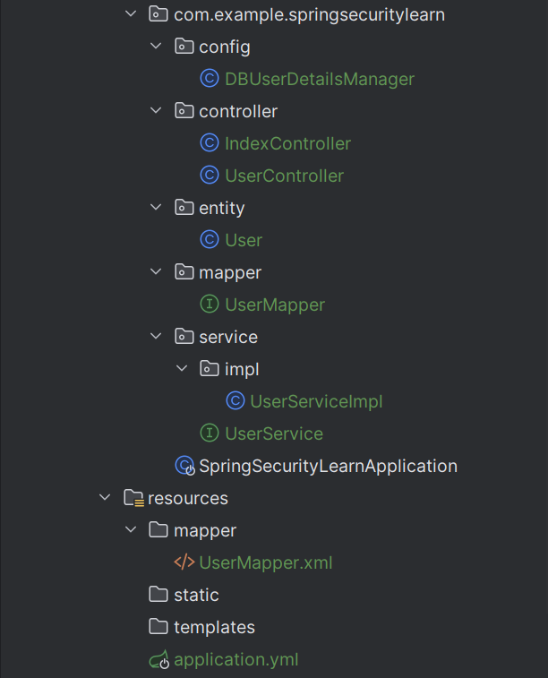


## 六、Authorization

Spring Security支持的认证方式有很多种

