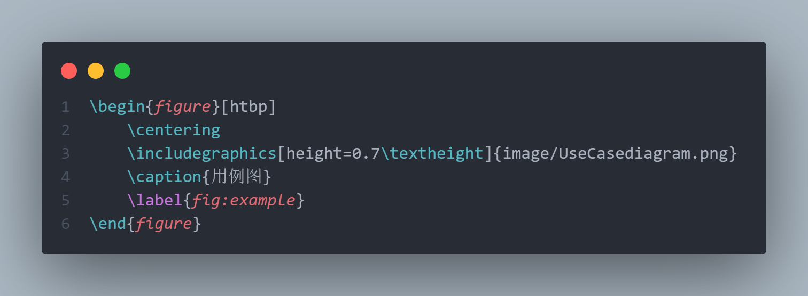

# LaTex

> 编译环境：VSCODE + TexLive + LaTeX WorkShop

```json
  "latex-workshop.latex.autoBuild.run":"never",
  "latex-workshop.message.error.show": false,
  "latex-workshop.message.warning.show":true,
  "latex-workshop.latex.recipes": [
    {
      "name": "xelatex",
      "tools": [
        "xelatex"
      ]
    },
    {
      "name": "pdflatex",
      "tools": [
        "pdflatex"
      ]
    }
  ],
  "latex-workshop.latex.tools": [

    {
      "name": "xelatex",
      "command": "xelatex",
      "args": [
        "-synctex=1",
        "-interaction=nonstopmode",
        "-file-line-error",
        "%DOCFILE%"
      ],
      "env": {}
    },
    {
      "name": "pdflatex",
      "command": "pdflatex",
      "args": [
        "-synctex=1",
        "-interaction=nonstopmode",
        "-file-line-error",
        "%DOC%"
      ],
      "env": {}
    }
  ]
```

- 将 tools 中的 `%DOC%`替换成`%DOCFILE%`就可以支持编译**中文路径下的文件了**）
- 中文环境常用的是==xelatex==
- 第一个 recipe 为默认的编译工具。但如果单击某个 recipe 然后再点击运行也可以用来切换编译方式。

## 一. 基础知识

### 1.1 文档类型

- 对于英文，可以用==book==、==article==、和==beamer==；

- 对于中文，可以用==ctextbook==、==ctexart==、和==ctexbeamer==；

不同的文件类型，编写的过程也会有一定的差异，直接修改文件类型可能会报错

设置文件类型：

```latex
\documentclass{ctexart}
```

另外还可以在==\documentclass==处设置基本参数

```latex
\documentclass[12pt,a4paper,oneside]{ctexart}
```

文件的正文部分需要放在 document 环境中，在 document 环境外的部分不会出现在文件中

```latex
\documentclass[12pt, a4paper, oneside]{ctexart}

\begin{document}

这里是正文.

\end{document}
```

### 1.2 宏包

为了完成一些功能（如定理环境），还需要在导言区，也即 document 环境之前加载宏包。加载宏包的代码是`\usepackage{}`。本份教程中，与数学公式与定理环境相关的宏包为`amsmath`、`amsthm`、`amssymb`，用于插入图片的宏包为`graphicx`，代码如下：

```latex
\usepackage{amsmath, amsthm, amssymb, graphicx}
```

另外，在加载宏包时还可以设置基本参数，如使用超链接宏包`hyperref`，可以设置引用的颜色为黑色等，代码如下：

```latex
\usepackage[bookmarks=true, colorlinks, citecolor=blue, linkcolor=black]{hyperref}
```

### 1.3 标题

标题可以用`\title{}`设置，作者可以用`\author`设置，日期可以用`\date{}`设置，这些都需要放在导言区。为了在文档中显示标题信息，需要使用`\maketitle`。例如：

```latex
\documentclass[12pt, a4paper, oneside]{ctexart}
\usepackage{amsmath, amsthm, amssymb, graphicx}
\usepackage[bookmarks=true, colorlinks, citecolor=blue, linkcolor=black]{hyperref}

% 导言区

\title{我的第一个\LaTeX 文档}
\author{Dylaaan}
\date{\today}

\begin{document}

\maketitle

这里是正文.

\end{document}
```

### 1.4 正文

正文可以直接在 document 环境中书写，没有必要加入空格来缩进，因为文档默认会进行首行缩进。相邻的两行在编译时仍然会视为同一段。在 LaTeX 中，另起一段的方式是使用一行相隔，例如：

```latex
我是第一段.

我是第二段.
```

这样编译出来就是两个段落。在正文部分，多余的空格、回车等等都会被自动忽略，这保证了全文排版不会突然多出一行或者多出一个空格。另外，另起一页的方式是：

```latex
\newpage
```

| 直立     | \textup{} |
| -------- | --------- |
| 意大利   | \textit{} |
| 倾斜     | \textsl{} |
| 小型大写 | \textsc{} |
| 加宽加粗 | \textbf{} |

### 1.5 章节

对于`ctexart`文件类型，章节可以用`\section{}`和`\subsection{}`命令来标记，例如：

```latex
\documentclass[12pt, a4paper, oneside]{ctexart}
\usepackage{amsmath, amsthm, amssymb, graphicx}
\usepackage[bookmarks=true, colorlinks, citecolor=blue, linkcolor=black]{hyperref}

% 导言区

\title{我的第一个\LaTeX 文档}
\author{Dylaaan}
\date{\today}

\begin{document}

\maketitle

\section{一级标题}

\subsection{二级标题}

这里是正文.

\subsection{二级标题}

这里是正文.

\end{document}
```

### 1.6 目录

在有了章节的结构之后，使用`\tableofcontents`命令就可以在指定位置生成目录。通常带有目录的文件需要编译两次，因为需要先在目录中生成.toc 文件，再据此生成目录。

```latex
\documentclass[12pt, a4paper, oneside]{ctexart}
\usepackage{amsmath, amsthm, amssymb, graphicx}
\usepackage[bookmarks=true, colorlinks, citecolor=blue, linkcolor=black]{hyperref}

% 导言区

\title{我的第一个\LaTeX 文档}
\author{Dylaaan}
\date{\today}

\begin{document}

\maketitle

\tableofcontents

\section{一级标题}

\subsection{二级标题}

这里是正文.

\subsection{二级标题}

这里是正文.

\end{document}
```

## 二. 图片

在 LaTeX 中插入图片通常需要使用 `\includegraphics` 命令，该命令需要在导言区添`\usepackage{graphicx}` 以使用相关的功能。图片所属文件夹 image 和.tex 文件同级



在这个例子中：

- `\includegraphics` 命令用于插入图片。你可以通过选项调整图片的大小、位置等。
- `figure` 环境用于包裹图片，并提供图形对象（如标题和标签）的位置控制。
- `\caption` 命令用于给图片添加标题。
- `\label` 命令用于为图片添加标签，方便在文档中引用。
- htbp：
  - `h` 表示"here"，指示 LaTeX 将尽可能将浮动对象放置在代码所在的位置。
  - `t` 表示"top"，指示 LaTeX 将浮动对象放置在页面的顶部。
  - `b` 表示"bottom"，指示 LaTeX 将浮动对象放置在页面的底部。
  - `p` 表示"page"，指示 LaTeX 将浮动对象放置在一个独立的页面上，该页面专门用于包含浮动对象。

这些选项通常以某种组合的形式使用，以指示 LaTeX 如何在文档中安排浮动对象的位置。LaTeX 根据一些因素（例如当前页面的空间、文档中其他浮动对象的位置等）来决定最终的放置位置。

你可以根据需要选择这些选项，或者将它们组合在一起，以便更好地控制浮动对象的位置。

### 2.1 调整图片尺寸

- 使用 `width` 和 `height` 选项来缩小图片尺寸，使其适应页面大小。如上例

- 分割图片
